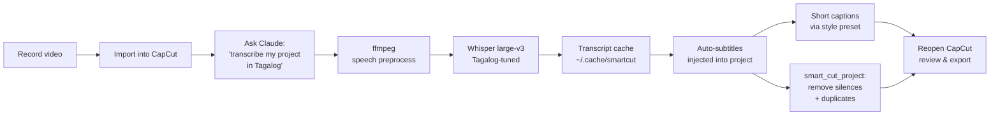

<div align="center">

# SmartCut

### AI-powered editing for CapCut, driven by Claude

Self-hosted Whisper transcription tuned to **beat CapCut's built-in auto-caption** — especially for Tagalog / Tag-Lish content. TikTok-style short captions with style presets. Automatic silence and duplicate-take removal. Dry-run preview. Per-project transcription caching. All without leaving the CapCut project.

[](https://www.python.org/)
[](https://modelcontextprotocol.io/)
[](LICENSE)
[](https://github.com/SYSTRAN/faster-whisper)
[]()

</div>

---

## What it does

You record a talking-head video. SmartCut handles the boring parts:

| Step | Tool | What happens |
|------|------|--------------|
| 1 | `transcribe_project` | Audio preprocess → Whisper with Tagalog-tuned defaults → cache → CapCut auto-subtitle track |
| 2 | `generate_short_captions` | Splits subtitles into chunks shaped by a **style preset** (TikTok, karaoke, news…) |
| 3 | `smart_cut_project` | Finds silences and duplicate takes from the subtitles and cuts them straight out of the timeline |
| 4 | `normalize_project_text` | Retroactively fix double-spacing in older projects |

No exporting. No re-rendering. No re-importing. Everything happens **inside the CapCut project files** — open CapCut afterwards and you see the captions and cuts.

---

## Why it's better than CapCut auto-caption

CapCut's built-in auto-caption is cloud-based and language-locked. SmartCut runs Whisper `large-v3` locally with **every accuracy dial turned up** for code-switched Filipino content:

- **Built-in Tagalog primer** — auto-activates on `language='tl'` so the decoder is biased toward Filipino vocab and Tag-Lish code-switching from the first word.
- **Multilingual decoding** — sentences that flip Tagalog ↔ English mid-utterance stay correct (CapCut force-locks to one language).
- **Anti-hallucination guards** — `hallucination_silence_threshold`, conservative `condition_on_previous_text`, log-prob fallbacks. Goodbye `[Music]` ghost captions.
- **Speech-tuned audio preprocessing** — high-pass / low-pass filters + EBU R128 loudness normalization in a single ffmpeg pass before Whisper sees the audio.
- **Per-word confidence filter** — strip low-confidence garbage tokens.
- **Hotwords / vocabulary biasing** — feed names, brands, jargon for max recognition.
- **Self-hosted** — no API key, no upload limits, no data leaving your machine.

---

## The full workflow



---

## Quick start

### 1. Clone and install

```bash
git clone git@github.com:rollenasistores/capcut-auto-caption.git
cd capcut-auto-caption
python -m venv venv
source venv/bin/activate          # Windows: venv\Scripts\activate
pip install -e '.[local]'         # installs faster-whisper
```

### 2. Pre-download the Whisper model

```bash
python -m smartcut.prefetch                  # default: large-v3 (~3 GB)
python -m smartcut.prefetch large-v3-turbo   # faster, ~1.6 GB
python -m smartcut.prefetch large-v3 cuda    # CUDA-ready weights
```

Progress bar streams to stderr; the model is cached at `~/.cache/huggingface/hub/`.

### 3. Install ffmpeg

| OS | Command |
|----|---------|
| macOS | `brew install ffmpeg` |
| Linux | `sudo apt install ffmpeg` |
| Windows | [Download from ffmpeg.org](https://ffmpeg.org/download.html) and add to PATH |

### 4. Wire it into Claude

```json
{
  "mcpServers": {
    "smartcut": {
      "command": "/absolute/path/to/capcut-auto-caption/venv/bin/python",
      "args": ["-m", "smartcut.server"]
    }
  }
}
```

Restart Claude and ask it about your CapCut projects.

---

## Usage

> All commands below are natural-language prompts to Claude. The MCP tools are picked automatically.

### List your projects

```
Show me my CapCut projects
```

### Transcribe a Tagalog project (recommended call)

```
Transcribe my "Vlog Episode 5" project in Tagalog.
Use hotwords "Manila, Cebu, Jollibee, Maria, kasi, talaga".
Drop words below 0.4 confidence.
```

Translates to: `transcribe_project(project_name="Vlog Episode 5", language="tl", hotwords="…", min_word_probability=0.4)`.

### Preview first, then apply (dry-run workflow)

```
Transcribe "Vlog" in Tagalog as a dry-run first so I can review.
```

Claude calls `transcribe_project(..., dry_run=True)`. You get the full transcript + chunked captions in the response without anything being written to CapCut. Approve the result and ask again to apply — the **cache makes the second call near-instant**.

```
Looks good — apply it.
```

### Pick a caption style

```
What caption presets do you have?

Transcribe "Vlog" with the karaoke preset.
Use the tiktok-yellow preset for "Reel #3" with 1-word chunks.
```

Available presets: `tiktok`, `tiktok-yellow`, `karaoke`, `minimal`, `news`, `podcast`. Run `list_caption_presets` to see chunk sizes, max chars, fonts, and positions.

### Strip filler words

```
Transcribe "Podcast 12" in Tagalog and strip fillers like "uhm", "kasi nga", "di ba".
```

Built-in list covers common Tagalog and English disfluencies plus stutter dedup. Extend with `extra_fillers=["parang", "tipong"]`.

### Smart cut

```
Smart cut "Vlog" — remove silences > 0.7s and duplicate takes.
```

> **Warning** — `smart_cut_project` modifies the project in place with no backup. Duplicate the project in CapCut first if you need the original.

### Inspect / clear the cache

```
How big is the transcript cache?
Clear the transcript cache.
```

---

## MCP tool reference

<table>
<tr><th>Tool</th><th>Purpose</th><th>Highlights</th></tr>

<tr><td><code>list_capcut_projects</code></td>
<td>Enumerate all CapCut projects in the drafts folder.</td>
<td>—</td></tr>

<tr><td><code>open_capcut_project</code></td>
<td>Load a project and return its structure.</td>
<td>—</td></tr>

<tr><td><code>transcribe_project</code></td>
<td>Whisper transcription → CapCut auto-subtitle track (+ optional short captions).</td>
<td>
<code>language</code> · <code>hotwords</code> · <code>initial_prompt</code> ·
<code>min_word_probability</code> · <code>compute_type</code> ·
<code>preprocess_audio</code> · <code>use_cache</code> · <code>dry_run</code> ·
<code>strip_fillers</code> · <code>caption_preset</code>
</td></tr>

<tr><td><code>generate_short_captions</code></td>
<td>Splits existing subtitles into chunks shaped by a style preset.</td>
<td>
<code>caption_preset</code> · <code>min_words</code> · <code>max_words</code> ·
<code>max_chars</code> · <code>max_duration_sec</code> · <code>prefer_sentences</code>
</td></tr>

<tr><td><code>list_caption_presets</code></td>
<td>Show every caption preset with its chunking + styling parameters.</td>
<td>—</td></tr>

<tr><td><code>normalize_project_text</code></td>
<td>Retroactively collapse double-spacing in existing CapCut text materials.</td>
<td>—</td></tr>

<tr><td><code>smart_cut_project</code></td>
<td>Remove silences and duplicate takes from the timeline.</td>
<td><code>silence_threshold_sec</code> · <code>similarity_threshold</code> · <code>use_openai</code></td></tr>

<tr><td><code>manage_transcript_cache</code></td>
<td>Inspect or clear the on-disk Whisper result cache.</td>
<td><code>action</code> = <i>stats</i> | <i>clear</i></td></tr>

</table>

---

## Caption presets

| Preset | Chunk | Style |
|--------|-------|-------|
| `tiktok` | 2–4 words, ≤24 chars, ≤2.2 s | Bold white, centered |
| `tiktok-yellow` | 1–3 words, ≤20 chars, ≤1.8 s | Bold **yellow** stroke, high-energy |
| `karaoke` | 1 word | Single-word cards for word-by-word reveal |
| `minimal` | 3–7 words, ≤42 chars | Translucent lower-third subtitle |
| `news` | 5–10 words, ≤60 chars | Opaque bar, broadcast style |
| `podcast` | 4–8 words, ≤50 chars | Roomy talking-head bottom-third |

Override any field per call: `caption_preset="tiktok"`, `max_words=3`, `position_y=0.6`.

---

## Configuration

All settings can be passed per-call or set globally via env vars / `.env` file.

| Variable | Default | Description |
|----------|---------|-------------|
| `WHISPER_BACKEND` | `local` | `local` (faster-whisper) or `openai` |
| `WHISPER_LOCAL_MODEL` | `large-v3` | `tiny` · `base` · `small` · `medium` · `large-v3` · `large-v3-turbo` · `distil-large-v3` |
| `WHISPER_DEVICE` | `cpu` | `cpu` (int8) or `cuda` (float16) |
| `WHISPER_COMPUTE_TYPE` | auto | Override: `int8`, `int8_float16`, `float16`, `float32` |
| `WHISPER_LANGUAGE` | — | Default ISO code (e.g. `tl`) — auto-activates the Filipino primer |
| `WHISPER_INITIAL_PROMPT` | — | Default decoder context — bias vocab project-wide |
| `WHISPER_HOTWORDS` | — | Default hotword list — names/brands/jargon |
| `WHISPER_MIN_WORD_PROBABILITY` | `0.0` | Drop words below this confidence |
| `SMARTCUT_CACHE_DIR` | `~/.cache/smartcut/transcripts` | Where Whisper result cache lives |
| `OPENAI_API_KEY` | — | Required only for `backend=openai` or `use_openai=true` |
| `CAPCUT_DRAFTS_DIR` | auto | Override the auto-detected CapCut drafts folder |

### Picking a Whisper model

| Model | Size | Speed (CPU int8) | Quality | When to use |
|-------|------|------------------|---------|-------------|
| `tiny` | 75 MB | very fast | low | Smoke tests |
| `base` | 145 MB | fast | OK | Drafting |
| `small` | 485 MB | medium | good | Most use cases |
| `medium` | 1.5 GB | slower | very good | Multi-language podcasts |
| `large-v3-turbo` | 1.6 GB | fast | very good | Modern speed/quality compromise |
| `distil-large-v3` | 1.5 GB | fast | very good | English-heavy, distilled |
| `large-v3` | 3 GB | slow on CPU | best | **Tagalog / multilingual final cuts** |

For final Tagalog cuts: `large-v3` + `compute_type=float16` on CUDA (or `int8` on CPU).

---

## How the transcription pipeline works

```
source video
   │
   ▼
[1] ffmpeg → 16 kHz mono WAV
       └── if preprocess_audio (default): highpass 80 → lowpass 8 kHz
            → dynaudnorm → EBU R128 loudnorm (-16 LUFS)
   │
   ▼
[2] blake2b hash of audio + canonical JSON of decoder params
       └── lookup ~/.cache/smartcut/transcripts/<key>.json
              └── HIT → reuse result (no Whisper call)
              └── MISS → continue
   │
   ▼
[3] Whisper transcribe (faster-whisper)
       └── language='tl' → built-in Tagalog primer auto-applied
       └── multilingual=True (Tag-Lish code-switching)
       └── hallucination_silence_threshold=2.0
       └── condition_on_previous_text=False
       └── hotwords / initial_prompt biasing
       └── word_timestamps=True
   │
   ▼
[4] Post-filter: drop words below min_word_probability;
                  drop tagalog/english fillers if strip_fillers
   │
   ▼
[5] Cache write (atomic temp-file rename)
   │
   ▼
[6] Source-time → timeline-time mapping per video segment
       (every clip captioned; supports splits + repeated sources)
   │
   ▼
[7] If dry_run → return preview; else write back to draft_info.json
```

---

## How the cuts work

SmartCut never re-encodes video. It edits the CapCut project's JSON:

```
draft_info.json
├── materials.videos[]      ← source media (unchanged)
├── materials.texts[]       ← subtitle materials (added / read)
└── tracks[]
    ├── video segments      ← trimmed by remove_time_ranges()
    ├── audio segments      ← trimmed in lockstep
    └── text segments       ← new caption track added
```

When `smart_cut_project` finds a gap or duplicate take it computes a `(start_us, end_us)` range to remove and walks **every** track, splitting / shifting segments so everything stays in sync.

---

## Troubleshooting

<details>
<summary><b>"No source videos found in project materials"</b></summary>

The project has no video clips on the timeline yet. Drop your video into CapCut, save, then close and re-run.
</details>

<details>
<summary><b>"ffmpeg not found on PATH"</b></summary>

Install ffmpeg (see Quick start). On Windows make sure `ffmpeg.exe` is in a directory listed in your `PATH`.
</details>

<details>
<summary><b>"faster-whisper is not installed"</b></summary>

You installed without the local extra. Re-run `pip install -e '.[local]'`.
</details>

<details>
<summary><b>large-v3 download is huge / slow on first run</b></summary>

Run `python -m smartcut.prefetch large-v3` upfront — you get a visible progress bar in your terminal. Or use a smaller model (`small`, `medium`, `large-v3-turbo`).
</details>

<details>
<summary><b>CapCut doesn't see the changes</b></summary>

CapCut watches the drafts folder but occasionally needs a restart to pick up external edits. Fully quit CapCut (not just close the window) and reopen.
</details>

<details>
<summary><b>"No auto-generated subtitles found" when running smart_cut_project</b></summary>

Run `transcribe_project` first — or generate captions inside CapCut via Text → Auto Captions.
</details>

<details>
<summary><b>Tagalog accuracy still not great</b></summary>

In order: (1) set `language='tl'`, (2) add project-specific `hotwords` for names/brands, (3) keep `preprocess_audio=True`, (4) try `min_word_probability=0.3-0.5`, (5) on CUDA, use `compute_type='float32'`, (6) bump `beam_size` to 8 or 10.
</details>

---

## Project layout

```
src/smartcut/
├── server.py                  MCP entrypoint, 8 tools
├── config.py                  Settings, env vars, defaults
├── prefetch.py                CLI: pre-download Whisper model weights
├── core/
│   ├── capcut_finder.py       Auto-detects CapCut drafts directory
│   ├── capcut_reader.py       Loads / modifies draft_info.json + caption normalization
│   ├── caption_style.py       Style presets + Tagalog filler stripping
│   ├── ffmpeg_utils.py        Audio extraction + ASR-tuned preprocessing
│   ├── model_download.py      Visible Whisper model download (HF hub + tqdm)
│   ├── transcript_cache.py    Content-addressed Whisper result cache
│   ├── whisper_client.py      OpenAI Whisper API backend
│   ├── whisper_local.py       faster-whisper backend, Tagalog-tuned defaults
│   ├── llm_client.py          GPT duplicate detection (optional)
│   └── models.py              Pydantic data models
└── tools/
    └── capcut_projects.py     The 8 MCP tool implementations
```

---

## Roadmap

Tier 2 features being considered (open an issue if you want one prioritized):

- LLM post-correction for Tagalog mishears (uses OPENAI_API_KEY)
- WhisperX / Stable-ts forced alignment for tighter word timings
- Voice isolation via Demucs (kill music bleed before Whisper)
- Speaker diarization (pyannote) — `Speaker 1: …`, `Speaker 2: …`
- Auto-translation to EN / ES on a parallel caption track
- Karaoke per-word color highlight animation

---

## License

MIT — see [LICENSE](LICENSE).

<div align="center">
<sub>Built for creators who'd rather hit record again than learn the timeline.</sub>
</div>
