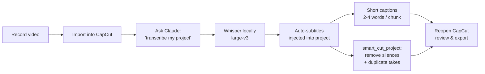

<div align="center">

# SmartCut

### AI-powered editing for CapCut, driven by Claude

Self-hosted Whisper transcription. TikTok-style short captions. Automatic silence and duplicate-take removal — all without leaving the CapCut project.

[](https://www.python.org/)
[](https://modelcontextprotocol.io/)
[](LICENSE)
[](https://github.com/SYSTRAN/faster-whisper)

</div>

---

## What it does

You record a talking-head video. SmartCut handles the boring parts:

| Step | Tool | What happens |
|------|------|--------------|
| 1 | `transcribe_project` | Runs Whisper locally on your video, drops word-timed subtitles into the CapCut project |
| 2 | `generate_short_captions` | Splits those subtitles into snappy 2–4 word chunks (TikTok / Reels style) on a separate track |
| 3 | `smart_cut_project` | Finds silences and duplicate takes from the subtitles and cuts them straight out of the timeline |

No exporting. No re-rendering. No re-importing. Everything happens **inside the CapCut project files** — open CapCut afterwards and you see the cuts.

---

## Why it's different

- **Self-hosted by default** — `faster-whisper` runs on your machine. No API keys, no usage limits, no data leaving your laptop.
- **Word-level timestamps** — short captions snap precisely to spoken words because we keep Whisper's per-word timing.
- **Operates on the project, not the video** — SmartCut edits `draft_info.json` directly, so cuts are non-destructive and fully reversible in CapCut's history.
- **Bring-your-own intelligence** — optional `OPENAI_API_KEY` unlocks GPT-assisted duplicate detection and the OpenAI Whisper API backend.

---

## The full workflow



---

## Quick start

### 1. Clone and install

```bash
git clone git@github.com:rollenasistores/capcut-auto-caption.git
cd capcut-auto-caption
python -m venv venv
source venv/bin/activate          # Windows: venv\Scripts\activate
pip install -e '.[local]'         # installs faster-whisper for self-hosted Whisper
```

### 2. Install ffmpeg

| OS | Command |
|----|---------|
| macOS | `brew install ffmpeg` |
| Linux | `sudo apt install ffmpeg` |
| Windows | [Download from ffmpeg.org](https://ffmpeg.org/download.html) and add to PATH |

### 3. Wire it into Claude

Add to your Claude Desktop or Claude Code MCP config:

```json
{
  "mcpServers": {
    "smartcut": {
      "command": "/absolute/path/to/capcut-auto-caption/venv/bin/python",
      "args": ["-m", "smartcut.server"]
    }
  }
}
```

That's it. Restart Claude and ask it about your CapCut projects.

---

## Usage

> All commands below are natural-language prompts to Claude. The MCP tools are picked automatically.

### List your projects

```
Show me my CapCut projects
```

### Inspect a project

```
Open CapCut project "Podcast Episode 5"
```

### Auto-caption a project end-to-end

```
Transcribe my "Podcast Episode 5" project
```

This runs Whisper `large-v3` locally, adds word-timed subtitles to the project, and (by default) also adds a 2–4 word short-caption track. First run downloads the model (~3 GB to `~/.cache/huggingface/`).

For a smaller/faster model:

```
Transcribe my "Vlog" project with model_size=base
```

To force the OpenAI Whisper API instead of local:

```
Transcribe "Vlog" with backend=openai
```

### Generate short captions on an existing project

If CapCut already produced auto-captions and you only want the punchy short version:

```
Generate short captions for "Vlog"
```

Tunable:

```
Generate short captions for "Vlog" with min_words=3, max_words=5, position_y=0.85
```

### Smart cut

```
Smart cut my "Podcast Episode 5" project
```

Removes silences > 1s and duplicate takes (keeps the latest take of each repeated phrase). Adjust thresholds:

```
Smart cut "Vlog" with silence_threshold_sec=0.7, similarity_threshold=0.5
```

For GPT-enhanced duplicate detection:

```
Smart cut "Vlog" with use_openai=true
```

> **Warning** — `smart_cut_project` modifies the project in place with no backup. Duplicate the project in CapCut first if you need the original.

---

## MCP tool reference

<table>
<tr><th>Tool</th><th>Purpose</th><th>Key parameters</th></tr>

<tr><td><code>list_capcut_projects</code></td>
<td>Enumerate all CapCut projects in the drafts folder.</td>
<td><code>drafts_dir</code></td></tr>

<tr><td><code>open_capcut_project</code></td>
<td>Load a project and return its structure (videos, text, subtitles).</td>
<td><code>project_name</code> · <code>project_path</code></td></tr>

<tr><td><code>transcribe_project</code></td>
<td>Whisper transcription → CapCut auto-subtitle track (+ optional short captions).</td>
<td>
<code>backend</code> (<i>local</i> | <i>openai</i>) ·
<code>model_size</code> ·
<code>device</code> (<i>cpu</i> | <i>cuda</i>) ·
<code>language</code> ·
<code>also_short_captions</code>
</td></tr>

<tr><td><code>generate_short_captions</code></td>
<td>Splits existing subtitles into 2–4 word chunks on a new text track.</td>
<td><code>min_words</code> · <code>max_words</code> · <code>font_size</code> · <code>bold</code> · <code>position_y</code></td></tr>

<tr><td><code>smart_cut_project</code></td>
<td>Removes silences and duplicate takes from the project timeline.</td>
<td><code>silence_threshold_sec</code> · <code>similarity_threshold</code> · <code>use_openai</code></td></tr>

</table>

---

## Configuration

All settings can be passed per-call or set globally via env vars / `.env` file.

| Variable | Default | Description |
|----------|---------|-------------|
| `WHISPER_BACKEND` | `local` | `local` (faster-whisper) or `openai` |
| `WHISPER_LOCAL_MODEL` | `large-v3` | `tiny` · `base` · `small` · `medium` · `large-v3` |
| `WHISPER_DEVICE` | `cpu` | `cpu` (int8 quantization) or `cuda` (float16) |
| `OPENAI_API_KEY` | — | Required only for `backend=openai` or `use_openai=true` |
| `CAPCUT_DRAFTS_DIR` | auto | Override the auto-detected CapCut drafts folder |

### Picking a Whisper model

| Model | Size | Speed (CPU) | Quality | When to use |
|-------|------|-------------|---------|-------------|
| `tiny` | 75 MB | very fast | low | Quick tests, English only |
| `base` | 145 MB | fast | OK | Drafting, mixed languages |
| `small` | 485 MB | medium | good | Most use cases |
| `medium` | 1.5 GB | slower | very good | Multi-language podcasts |
| `large-v3` | 3 GB | slow on CPU | best | Final cuts, Tagalog / multilingual |

GPU users — set `WHISPER_DEVICE=cuda` for 5–10× speedup with `large-v3`.

---

## How the cuts work

SmartCut never re-encodes video. It edits the CapCut project's JSON:

```
draft_info.json
├── materials.videos[]      ← source media (unchanged)
├── materials.texts[]       ← subtitle materials (added / read)
└── tracks[]
    ├── video segments      ← trimmed by remove_time_ranges()
    ├── audio segments      ← trimmed in lockstep
    └── text segments       ← new caption track added
```

When `smart_cut_project` finds a gap or duplicate take, it computes a `(start_us, end_us)` range to remove and walks **every** track in the project, splitting / shifting segments so everything stays in sync. Open the project in CapCut afterwards and you'll see the timeline already shortened — undo works as expected.

---

## Troubleshooting

<details>
<summary><b>"No source videos found in project materials"</b></summary>

The project has no video clips on the timeline yet. Drop your video into CapCut, save, then close and re-run.
</details>

<details>
<summary><b>"ffmpeg not found on PATH"</b></summary>

Install ffmpeg (see <a href="#2-install-ffmpeg">Quick start</a>). On Windows, make sure `ffmpeg.exe` is in a directory listed in your `PATH` env var.
</details>

<details>
<summary><b>"faster-whisper is not installed"</b></summary>

You installed without the local extra. Re-run:

```bash
pip install -e '.[local]'
```
</details>

<details>
<summary><b>large-v3 download is huge / slow</b></summary>

The model is ~3 GB on first use, cached at `~/.cache/huggingface/`. Use a smaller model (`small` or `medium`) if disk space is tight — pass <code>model_size=small</code> in the call.
</details>

<details>
<summary><b>CapCut doesn't see the changes</b></summary>

CapCut watches the drafts folder but occasionally needs a restart to pick up external edits. Fully quit CapCut (not just close the window) and reopen.
</details>

<details>
<summary><b>"No auto-generated subtitles found" when running smart_cut_project</b></summary>

Run <code>transcribe_project</code> first — or generate captions inside CapCut via Text → Auto Captions.
</details>

---

## Project layout

```
src/smartcut/
├── server.py                  MCP entrypoint, 5 tools
├── config.py                  Settings, env vars, defaults
├── core/
│   ├── capcut_finder.py       Auto-detects CapCut drafts directory
│   ├── capcut_reader.py       Loads / modifies draft_info.json
│   ├── ffmpeg_utils.py        Audio extraction
│   ├── whisper_client.py      OpenAI Whisper API backend
│   ├── whisper_local.py       faster-whisper backend (default)
│   ├── llm_client.py          GPT duplicate detection (optional)
│   └── models.py              Pydantic data models
└── tools/
    └── capcut_projects.py     The 5 MCP tool implementations
```

---

## License

MIT — see [LICENSE](LICENSE).

<div align="center">
<sub>Built for creators who'd rather hit record again than learn the timeline.</sub>
</div>
